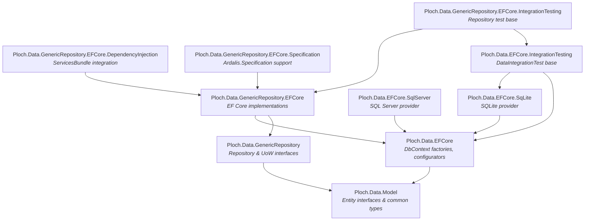
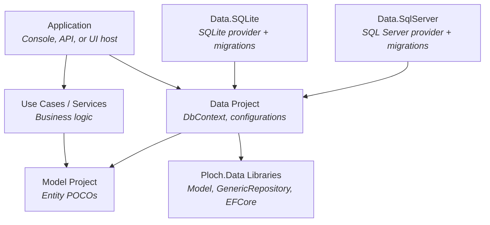

# Architecture Overview

This document describes the high-level architecture of the Ploch.Data libraries, their package dependencies, and how they fit into an application's layered design.

## Package Dependency Graph

## Design Principles

### Separation of Concerns

The libraries are split along clear responsibilities:

- **Ploch.Data.Model** -- pure interfaces and POCOs with no framework dependencies. Targets `netstandard2.0` for maximum compatibility.
- **Ploch.Data.GenericRepository** -- provider-agnostic interfaces. No dependency on EF Core.
- **Ploch.Data.GenericRepository.EFCore** -- EF Core-specific implementations. Keeps the ORM concern isolated.
- **Provider packages (SQLite, SQL Server)** -- database-specific configuration. Swappable without changing business logic.

### Interface Segregation

Repository interfaces follow the Interface Segregation Principle:

- Consumers needing only reads inject `IReadRepositoryAsync<TEntity, TId>`.
- Consumers needing full CRUD inject `IReadWriteRepositoryAsync<TEntity, TId>`.
- Consumers needing multi-entity transactions inject `IUnitOfWork`.

This minimises coupling and makes the intent of each consumer explicit.

### Testability

Every layer is designed for testability:

- Repository interfaces can be mocked for unit tests.
- Integration test base classes provide pre-configured in-memory SQLite databases.
- The `IDbContextConfigurator` abstraction allows swapping providers in tests.

## Application Layer Pattern

A typical application using Ploch.Data follows this layered structure:

### Layer Responsibilities

| Layer | Responsibility | Key Types |
|-------|---------------|-----------|
| **Model** | Domain entity definitions | `Article`, `Author`, `ArticleCategory`, etc. |
| **Data** | DbContext, entity configurations, DI registration | `MyDbContext`, `ArticleConfiguration`, `ServiceCollectionRegistrations` |
| **Data.SQLite / Data.SqlServer** | Provider-specific factories, migrations | `MyDbContextFactory`, EF Core migrations |
| **Use Cases / Services** | Business logic consuming repositories | Service classes injecting `IReadRepositoryAsync`, `IUnitOfWork` |
| **Application** | Host setup, DI composition | `Program.cs`, `Startup.cs` |

### Dependency Flow

Dependencies flow inward:

1. **Application** depends on everything below.
2. **Use Cases** depend on **Model** and **GenericRepository interfaces** (never on EF Core directly).
3. **Data** depends on **Model** and **Ploch.Data.EFCore** / **GenericRepository.EFCore**.
4. **Provider projects** depend on **Data** and provider-specific packages.
5. **Model** has no project dependencies (only `Ploch.Data.Model`).

This ensures the business logic (Use Cases) remains ORM-agnostic.

## Key Components

### BaseDbContextFactory

Abstract base for design-time factories. Reads the connection string from `appsettings.json` and delegates provider-specific configuration to subclasses. The `TFactory` type parameter enables `ApplyMigrationsAssembly` to resolve the correct migrations assembly.

### IDbContextConfigurator

An abstraction for configuring `DbContextOptionsBuilder` at runtime. Implementations exist for SQLite (`SqLiteDbContextConfigurator`) and SQL Server (`SqlServerDbContextConfigurator`). Used by the DI registration layer and by integration test base classes.

### AuditEntityHandler

Handles setting audit properties (`CreatedTime`, `ModifiedTime`, `CreatedBy`, `LastModifiedBy`) on entities when they are added or updated through repositories. Registered automatically by `AddRepositories<TDbContext>()`.

### UnitOfWork

The `UnitOfWork<TDbContext>` class wraps the EF Core `DbContext.SaveChangesAsync()` call and resolves repositories dynamically. It ensures all changes across multiple repositories are committed (or rolled back) as a single database transaction.

## Package Details

### Ploch.Data.Model

- **Target:** `netstandard2.0`
- **Dependencies:** None (apart from `System.ComponentModel.Annotations`)
- **Purpose:** Define the common entity vocabulary used across all Ploch projects.

### Ploch.Data.EFCore

- **Target:** `net9.0`
- **Dependencies:** `Microsoft.EntityFrameworkCore`, `Ploch.Data.Model`
- **Purpose:** EF Core utilities including `BaseDbContextFactory`, `ConnectionString` helper, `IDbContextConfigurator`, `DataSeeder`, and `CollectionStringSplitConverter`.

### Ploch.Data.EFCore.SqLite

- **Target:** `net9.0`
- **Dependencies:** `Ploch.Data.EFCore`, `Microsoft.EntityFrameworkCore.Sqlite`
- **Purpose:** SQLite-specific factory, configurator, and the `DateTimeOffset` workaround.

### Ploch.Data.EFCore.SqlServer

- **Target:** `net9.0`
- **Dependencies:** `Ploch.Data.EFCore`, `Microsoft.EntityFrameworkCore.SqlServer`
- **Purpose:** SQL Server-specific factory and configurator.

### Ploch.Data.GenericRepository

- **Target:** `net10.0`
- **Dependencies:** `Ploch.Data.Model`
- **Purpose:** Provider-agnostic repository and Unit of Work interfaces, exception types, and audit handler abstractions.

### Ploch.Data.GenericRepository.EFCore

- **Target:** `net10.0`
- **Dependencies:** `Ploch.Data.GenericRepository`, `Ploch.Data.EFCore`, `Microsoft.EntityFrameworkCore`
- **Purpose:** EF Core implementations of all repository interfaces, `UnitOfWork`, and DI registration via `ServiceCollectionRegistration`.

### Ploch.Data.GenericRepository.EFCore.Specification

- **Target:** `net10.0`
- **Dependencies:** `Ploch.Data.GenericRepository.EFCore`, `Ardalis.Specification.EntityFrameworkCore`
- **Purpose:** Extension methods `GetAllBySpecificationAsync` and `GetBySpecificationAsync` for composable queries.

### Ploch.Data.EFCore.IntegrationTesting

- **Target:** `net10.0`
- **Dependencies:** `Ploch.Data.EFCore`, `Ploch.Data.EFCore.SqLite`
- **Purpose:** `DataIntegrationTest<TDbContext>` base class and `DbContextServicesRegistrationHelper`.

### Ploch.Data.GenericRepository.EFCore.IntegrationTesting

- **Target:** `net10.0`
- **Dependencies:** `Ploch.Data.EFCore.IntegrationTesting`, `Ploch.Data.GenericRepository.EFCore`
- **Purpose:** `GenericRepositoryDataIntegrationTest<TDbContext>` with repository and UoW helper methods.

## See Also

- [Getting Started](getting-started.md)
- [Data Model Guide](data-model.md)
- [Generic Repository Guide](generic-repository.md)
- [Data Project Setup](data-project-setup.md)
- [Extending the Libraries](extending.md)
