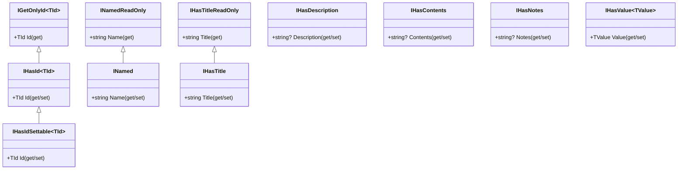
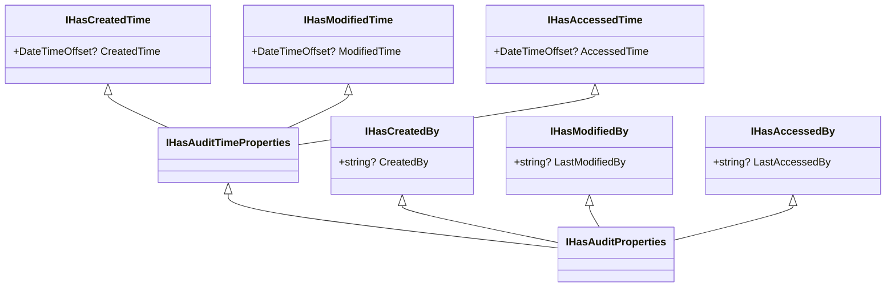

# Ploch.Data.Model -- Data Model Library Guide

`Ploch.Data.Model` provides a set of interfaces and base types that standardise common entity properties across .NET applications. By implementing these interfaces, entities gain consistent property names and types, enabling reusable UI components, generic repository operations, centralised audit handling, and consistent API shapes.

## Core Property Interfaces

These interfaces define standard properties that entities can implement.



### Interface Reference

| Interface | Property | Type | Notes |
|-----------|----------|------|-------|
| `IGetOnlyId<TId>` | `Id` | `TId` (get only) | Read-only identifier |
| `IHasId<TId>` | `Id` | `TId` | Primary key. Every repository entity must implement this. |
| `IHasIdSettable<TId>` | `Id` | `TId` | Settable identifier (extends `IHasId<TId>`) |
| `INamedReadOnly` | `Name` | `string` (get only) | Read-only name |
| `INamed` | `Name` | `string` | Read/write name |
| `IHasTitleReadOnly` | `Title` | `string` (get only) | Read-only title |
| `IHasTitle` | `Title` | `string` | Read/write title |
| `IHasDescription` | `Description` | `string?` | Optional description |
| `IHasContents` | `Contents` | `string?` | Textual content body |
| `IHasNotes` | `Notes` | `string?` | Free-form notes |
| `IHasValue<TValue>` | `Value` | `TValue` | Typed value property |

### Usage Example

````csharp
using Ploch.Data.Model;

public class Article : IHasId<int>, IHasTitle, IHasDescription, IHasContents
{
    public int Id { get; set; }
    public string Title { get; set; } = null!;
    public string? Description { get; set; }
    public string? Contents { get; set; }
}
````

## Audit Interfaces

Audit interfaces allow centralised tracking of creation, modification, and access timestamps plus user identity.



### Choosing the Right Audit Interface

| Interface | Provides | Use When |
|-----------|----------|----------|
| `IHasCreatedTime` | `CreatedTime` only | You only need creation timestamp |
| `IHasModifiedTime` | `ModifiedTime` only | You only need modification timestamp |
| `IHasAccessedTime` | `AccessedTime` only | You only need access timestamp |
| `IHasAuditTimeProperties` | All three timestamps | You need timestamps but not user tracking |
| `IHasCreatedBy` | `CreatedBy` only | You need the creating user |
| `IHasModifiedBy` | `LastModifiedBy` only | You need the modifying user |
| `IHasAccessedBy` | `LastAccessedBy` only | You need the accessing user |
| `IHasAuditProperties` | All timestamps + all user fields | Full audit trail |

### Usage Example

````csharp
using Ploch.Data.Model;

// Full audit trail
public class Invoice : IHasId<int>, IHasAuditProperties
{
    public int Id { get; set; }
    public decimal Amount { get; set; }

    // IHasAuditTimeProperties
    public DateTimeOffset? CreatedTime { get; set; }
    public DateTimeOffset? ModifiedTime { get; set; }
    public DateTimeOffset? AccessedTime { get; set; }

    // User tracking
    public string? CreatedBy { get; set; }
    public string? LastModifiedBy { get; set; }
    public string? LastAccessedBy { get; set; }
}
````

### Centralised Audit Timestamp Handling

Override `SaveChanges` and `SaveChangesAsync` in your DbContext to automatically set timestamps:

````csharp
public override Task<int> SaveChangesAsync(CancellationToken cancellationToken = default)
{
    var now = DateTimeOffset.UtcNow;
    foreach (var entry in ChangeTracker.Entries<IHasAuditTimeProperties>())
    {
        switch (entry.State)
        {
            case EntityState.Added:
                entry.Entity.CreatedTime = now;
                entry.Entity.ModifiedTime = now;
                break;
            case EntityState.Modified:
                entry.Entity.ModifiedTime = now;
                break;
        }
    }

    return base.SaveChangesAsync(cancellationToken);
}
````

The Generic Repository also provides an `IAuditEntityHandler` / `AuditEntityHandler` that handles audit properties at the repository level, setting timestamps and user info via `IUserInfoProvider` when entities are added or updated. This is configured automatically by `AddRepositories<TDbContext>()`.

## Hierarchical Interfaces

These interfaces support parent/child tree structures.

```mermaid
classDiagram
    class IHierarchicalWithParent~TParent~ {
        +TParent? Parent
    }
    class IHierarchicalWithChildren~TChildren~ {
        +ICollection~TChildren~? Children
    }
    class IHierarchicalWithParentComposite~T~ {
        (self-referential Parent)
    }
    class IHierarchicalWithChildrenComposite~T~ {
        (self-referential Children)
    }
    class IHierarchicalParentChildrenComposite~T~ {
        (self-referential Parent + Children)
    }

    IHierarchicalWithParent <|-- IHierarchicalWithParentComposite
    IHierarchicalWithChildren <|-- IHierarchicalWithChildrenComposite
    IHierarchicalWithParentComposite <|-- IHierarchicalParentChildrenComposite
    IHierarchicalWithChildrenComposite <|-- IHierarchicalParentChildrenComposite
```

### Interface Reference

| Interface | Parent | Children | Self-Referential |
|-----------|--------|----------|------------------|
| `IHierarchicalWithParent<TParent>` | Yes | No | No |
| `IHierarchicalWithChildren<TChildren>` | No | Yes | No |
| `IHierarchicalWithParentComposite<T>` | Yes | No | Yes (T must be self-type) |
| `IHierarchicalWithChildrenComposite<T>` | No | Yes | Yes (T must be self-type) |
| `IHierarchicalParentChildrenComposite<T>` | Yes | Yes | Yes (both parent and children are self-type) |

### Usage Example

````csharp
using Ploch.Data.Model;

// Self-referential tree structure (e.g., folder hierarchy)
public class Folder : IHasId<int>, INamed,
                      IHierarchicalParentChildrenComposite<Folder>
{
    public int Id { get; set; }
    public string Name { get; set; } = null!;
    public virtual Folder? Parent { get; set; }
    public virtual ICollection<Folder>? Children { get; set; }
}
````

## Categorisation and Tagging

Ploch.Data.Model provides standardised support for categorising and tagging entities.

### Categories (`IHasCategories<TCategory>`)

Categories are hierarchical -- each category can have a parent and children. Your category type must inherit from `Category<TCategory>` (or `Category<TCategory, TId>` for non-`int` IDs).

````csharp
using Ploch.Data.Model;
using Ploch.Data.Model.CommonTypes;

// Define a domain-specific category
public class ArticleCategory : Category<ArticleCategory>
{ }

// Entity with categories
public class Article : IHasId<int>, IHasTitle,
                       IHasCategories<ArticleCategory>
{
    public int Id { get; set; }
    public string Title { get; set; } = null!;
    public ICollection<ArticleCategory>? Categories { get; set; }
}
````

### Tags (`IHasTags<TTag>`)

Tags are flat (non-hierarchical) labels. Your tag type must inherit from `Tag<TId>` (or `Tag` for `int` IDs).

````csharp
using Ploch.Data.Model;
using Ploch.Data.Model.CommonTypes;

// Define a domain-specific tag
public class ArticleTag : Tag<int>
{ }

// Entity with tags
public class Article : IHasId<int>, IHasTitle,
                       IHasTags<ArticleTag>
{
    public int Id { get; set; }
    public string Title { get; set; } = null!;
    public ICollection<ArticleTag> Tags { get; set; } = new List<ArticleTag>();
}
````

## Common Base Types

The `Ploch.Data.Model.CommonTypes` namespace provides ready-to-use base classes.

### `Category<TCategory>` / `Category<TCategory, TId>`

A hierarchical category with `Id`, `Name`, `Parent`, and `Children`. Implements `IHasId<TId>`, `INamed`, and `IHierarchicalParentChildrenComposite<TCategory>`.

````csharp
// int-based ID (default)
public class ProductCategory : Category<ProductCategory> { }

// Guid-based ID
public class DocumentCategory : Category<DocumentCategory, Guid> { }
````

### `Tag<TId>` / `Tag`

A flat label with `Id`, `Name`, and `Description`. Implements `IHasId<TId>`, `INamed`, and `IHasDescription`.

````csharp
// int-based ID (default)
public class BlogTag : Tag { }

// string-based ID
public class SlugTag : Tag<string> { }
````

### `Property<TValue>` / `Property<TId, TValue>`

A name/value pair with `Id`, `Name`, and `Value`. Implements `IHasId<TId>`, `INamed`, and `IHasValue<TValue>`.

````csharp
// String property with int ID
public class ArticleProperty : Property<string> { }

// Custom typed property
public class SettingProperty : Property<Guid, decimal> { }
````

### Specialised Property Types

| Type | Value Type | Use Case |
|------|-----------|----------|
| `StringProperty` | `string` | Text-based metadata properties |
| `IntProperty` | `int` | Numeric metadata properties |

### `Image`

A simple image entity with `Id`, `Name`, `Description`, and `Url`. Useful for storing image metadata.

## Benefits of Standardised Interfaces

1. **Reusable UI components** -- Generic components can render/edit any entity implementing `IHasTitle` or `INamed` without knowing the concrete type.
2. **Consistent APIs** -- API endpoints and DTOs can be generated for any entity implementing the standard interfaces.
3. **Centralised audit handling** -- Override `SaveChanges` once to set timestamps on all `IHasAuditTimeProperties` entities.
4. **Generic repository operations** -- Repository methods work with any entity implementing `IHasId<TId>`.
5. **Standardised testing** -- Test helpers and builders can operate on any conforming entity.

## See Also

- [Getting Started](getting-started.md)
- [Generic Repository Guide](generic-repository.md)
- [Sample Application](../samples/SampleApp/) -- demonstrates entity modelling with all interface types
