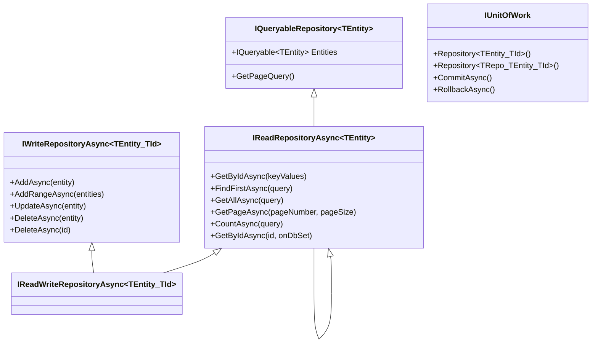

# Generic Repository Guide

The Generic Repository and Unit of Work libraries provide a clean abstraction over data access, decoupling business logic from the underlying ORM. The core interfaces are defined in `Ploch.Data.GenericRepository` (provider-agnostic), with EF Core implementations in `Ploch.Data.GenericRepository.EFCore`.

## Repository Interface Hierarchy



### Choosing the Right Interface

Inject the **most restrictive** interface that satisfies the consumer's needs:

| Interface | Purpose | Use When |
|-----------|---------|----------|
| `IQueryableRepository<TEntity>` | Direct `IQueryable<TEntity>` access | Advanced LINQ scenarios (prefer Specification pattern instead) |
| `IReadRepositoryAsync<TEntity>` | Read operations without typed ID | Reading entities where ID type does not matter |
| `IReadRepositoryAsync<TEntity, TId>` | Typed read operations | Reading entities by primary key |
| `IWriteRepositoryAsync<TEntity, TId>` | Write-only operations | Rare; when only writes are needed |
| `IReadWriteRepositoryAsync<TEntity, TId>` | Full CRUD | Complete read + write access to a single entity type |

**Constraint:** All entities used with typed repositories must implement `IHasId<TId>` from `Ploch.Data.Model`.

## Read Operations

### GetByIdAsync

Retrieve a single entity by its primary key:

````csharp
var product = await repository.GetByIdAsync(42);
if (product is null)
{
    // Not found
}
````

With eager loading:

````csharp
var product = await repository.GetByIdAsync(42,
    onDbSet: q => q.Include(p => p.Category)
                   .Include(p => p.Tags));
````

### GetAllAsync

Retrieve all entities, optionally with a filter:

````csharp
// All entities
var all = await repository.GetAllAsync();

// With filter
var active = await repository.GetAllAsync(p => p.IsActive);

// With eager loading
var withDetails = await repository.GetAllAsync(
    query: p => p.IsActive,
    onDbSet: q => q.Include(p => p.Tags));
````

### FindFirstAsync

Find the first entity matching a predicate:

````csharp
var product = await repository.FindFirstAsync(
    p => p.Name == "Widget",
    onDbSet: q => q.Include(p => p.Category));
````

### GetPageAsync

Paginated queries with optional sorting and filtering:

````csharp
var page = await repository.GetPageAsync(
    pageNumber: 1,
    pageSize: 20,
    sortBy: p => p.Title,
    query: p => p.IsActive);
````

### CountAsync

Count entities with optional filter:

````csharp
var total = await repository.CountAsync();
var activeCount = await repository.CountAsync(p => p.IsActive);
````

## Write Operations

### AddAsync / AddRangeAsync

````csharp
// Single entity
var entity = new Product { Title = "New Product" };
await repository.AddAsync(entity);
// entity.Id is populated after save

// Multiple entities
var entities = new[] { new Tag { Name = "A" }, new Tag { Name = "B" } };
await repository.AddRangeAsync(entities);
````

### UpdateAsync

````csharp
var existing = await repository.GetByIdAsync(id);
existing.Title = "Updated Title";
await repository.UpdateAsync(existing);
````

**Note:** `UpdateAsync` throws `EntityNotFoundException` if the entity does not exist.

### DeleteAsync

By entity reference or by ID:

````csharp
await repository.DeleteAsync(entity);
await repository.DeleteAsync(entityId);
````

Deleting by ID throws `EntityNotFoundException` if the entity does not exist.

## Unit of Work

`IUnitOfWork` combines multiple repository operations into a single atomic transaction. All changes are committed (or rolled back) together.

### API

````csharp
public interface IUnitOfWork : IDisposable
{
    IReadWriteRepositoryAsync<TEntity, TId> Repository<TEntity, TId>()
        where TEntity : class, IHasId<TId>;

    TRepository Repository<TRepository, TEntity, TId>()
        where TRepository : IReadWriteRepositoryAsync<TEntity, TId>
        where TEntity : class, IHasId<TId>;

    Task<int> CommitAsync(CancellationToken cancellationToken = default);
    Task RollbackAsync(CancellationToken cancellationToken = default);
}
````

### Usage

````csharp
public class CreateOrderUseCase(IUnitOfWork unitOfWork)
{
    public async Task ExecuteAsync(Order order, IEnumerable<OrderItem> items)
    {
        var orderRepo = unitOfWork.Repository<Order, int>();
        var itemRepo = unitOfWork.Repository<OrderItem, int>();

        await orderRepo.AddAsync(order);
        foreach (var item in items)
        {
            await itemRepo.AddAsync(item);
        }

        // Commit all changes atomically
        await unitOfWork.CommitAsync();
    }
}
````

### When to Use Unit of Work vs Direct Repository

| Scenario | Recommendation |
|----------|---------------|
| Single entity type, read-only | Inject `IReadRepositoryAsync<TEntity, TId>` directly |
| Single entity type, read + write | Inject `IReadWriteRepositoryAsync<TEntity, TId>` directly |
| Multiple entity types, atomic transaction needed | Inject `IUnitOfWork` |
| Need explicit commit/rollback control | Inject `IUnitOfWork` |

## Eager Loading with onDbSet

Several read methods accept an `onDbSet` parameter of type `Func<IQueryable<TEntity>, IQueryable<TEntity>>`. Use this to chain `.Include()` and `.ThenInclude()` calls:

````csharp
var article = await repository.GetByIdAsync(articleId,
    onDbSet: q => q
        .Include(a => a.Author)
        .Include(a => a.Categories)
        .Include(a => a.Tags)
        .Include(a => a.Properties));
````

This pattern is available on `GetByIdAsync`, `FindFirstAsync`, `GetAllAsync`, and `GetPageAsync`.

## DI Registration

### Standard Registration

A single call registers all repository interfaces and `IUnitOfWork`:

````csharp
services.AddDbContext<MyDbContext>(options => options.UseSqlite(connectionString));
services.AddRepositories<MyDbContext>(configuration);
````

This registers:
- `IQueryableRepository<TEntity>` as `QueryableRepository<TEntity>`
- `IReadRepositoryAsync<TEntity>` as `ReadRepositoryAsync<TEntity>`
- `IReadRepositoryAsync<TEntity, TId>` as `ReadRepositoryAsync<TEntity, TId>`
- `IReadWriteRepositoryAsync<TEntity, TId>` as `ReadWriteRepositoryAsync<TEntity, TId>`
- `IUnitOfWork` as `UnitOfWork<TDbContext>`
- `IAuditEntityHandler` as `AuditEntityHandler`

### ServicesBundle Registration

For applications using the `ServicesBundle` pattern from `Ploch.Common`, inherit from `GenericRepositoriesServicesBundle<TDbContext>`:

````csharp
using Ploch.Data.GenericRepository.EFCore.DependencyInjection;

public class MyDataBundle : GenericRepositoriesServicesBundle<MyDbContext>
{
    protected override Action<DbContextOptionsBuilder> GetOptionsBuilderAction(
        IConfiguration? configuration)
    {
        return options => options.UseSqlite(
            configuration!.GetConnectionString("DefaultConnection"));
    }
}

// Registration
services.AddServicesBundle(new MyDataBundle(), configuration);
````

### Custom Repository Registration

When extending the base repository with domain-specific logic:

````csharp
// 1. Define the interface
public interface IArticleRepository : IReadWriteRepositoryAsync<Article, int>
{
    Task<IList<Article>> GetPublishedAsync(CancellationToken ct = default);
}

// 2. Implement it
public class ArticleRepository(DbContext dbContext, IAuditEntityHandler auditHandler)
    : ReadWriteRepositoryAsync<Article, int>(dbContext, auditHandler),
      IArticleRepository
{
    public async Task<IList<Article>> GetPublishedAsync(CancellationToken ct = default)
    {
        return await Entities
            .Where(a => a.IsPublished)
            .Include(a => a.Author)
            .ToListAsync(ct);
    }
}

// 3. Register it (replaces default repository registrations for Article)
services.AddCustomReadWriteAsyncRepository<
    IArticleRepository, ArticleRepository, Article, int>();
````

`AddCustomReadWriteAsyncRepository` registers the custom type for:
- `IArticleRepository`
- `IReadWriteRepositoryAsync<Article, int>`
- `IWriteRepositoryAsync<Article, int>`
- `IReadRepositoryAsync<Article, int>`
- `IReadRepositoryAsync<Article>`
- `IQueryableRepository<Article>`

## Specification Pattern (Ardalis.Specification)

The `Ploch.Data.GenericRepository.EFCore.Specification` package integrates with [Ardalis.Specification](https://github.com/ardalis/Specification) for composable, reusable query logic.

### Defining Specifications

````csharp
using Ardalis.Specification;

// Multi-result specification
public class PublishedArticlesSpec : Specification<Article>
{
    public PublishedArticlesSpec(string? titleContains = null)
    {
        Query
            .Include(a => a.Author)
            .Include(a => a.Tags)
            .Where(a => a.IsPublished)
            .Where(a => a.Title.Contains(titleContains!),
                   titleContains is not null);
    }
}

// Single-result specification
public class ArticleBySlugSpec : SingleResultSpecification<Article>
{
    public ArticleBySlugSpec(string slug)
    {
        Query
            .Include(a => a.Author)
            .Include(a => a.Categories)
            .Where(a => a.Slug == slug);
    }
}
````

### Using Specifications

````csharp
using Ploch.Data.GenericRepository.EFCore.Specification;

// Multi-result
var articles = await repository.GetAllBySpecificationAsync(
    new PublishedArticlesSpec("EF Core"));

// Single result
var article = await repository.GetBySpecificationAsync(
    new ArticleBySlugSpec("getting-started"));
````

### Guidelines

- Use `Specification<TEntity>` for queries returning multiple results.
- Use `SingleResultSpecification<TEntity>` for queries returning zero or one result.
- Use conditional `Where` clauses with the boolean overload: `.Where(predicate, condition)`.
- Include related entities via `Query.Include()` and `.ThenInclude()`.

## Audit Handling

The repository layer supports automatic audit property population via `IAuditEntityHandler`. When `AddRepositories<TDbContext>()` is called, it registers:

- `AuditEntityHandler` -- sets `CreatedTime`, `ModifiedTime`, `CreatedBy`, and `LastModifiedBy` on entities implementing the corresponding interfaces.
- `NullUserInfoProvider` -- default no-op user provider. Replace with your own `IUserInfoProvider` to populate user fields.

Audit handling is controlled by the `RepositoriesConfiguration.EnableAuditing` option, which defaults to reading from configuration section `RepositoriesConfiguration`.

## Error Handling

Repository operations throw specific exceptions from `Ploch.Data.GenericRepository.Exceptions`:

| Exception | When Thrown | Suggested Handling |
|-----------|------------|-------------------|
| `DataAccessException` | Base type for all data access errors | Log and return error result |
| `DataReadException` | Read operation failure | Log and return error result |
| `DataUpdateException` | `CommitAsync()` or write operation failure | Log and return error result |
| `DataUpdateConcurrencyException` | Optimistic concurrency violation | Retry or notify user |
| `EntityNotFoundException` | `UpdateAsync` or `DeleteAsync(id)` when entity not found | Return 404 / not found |

### Example

````csharp
try
{
    await unitOfWork.CommitAsync(ct);
}
catch (DataUpdateConcurrencyException ex)
{
    logger.LogWarning(ex, "Concurrency conflict for entity");
    return Result.Error("The record was modified by another user.");
}
catch (DataUpdateException ex)
{
    logger.LogError(ex, "Failed to save changes");
    return Result.Error(ex.Message);
}
````

## See Also

- [Getting Started](getting-started.md)
- [Data Model Guide](data-model.md)
- [Integration Testing](integration-testing.md)
- [Sample Application](../samples/SampleApp/) -- working examples of all repository operations
